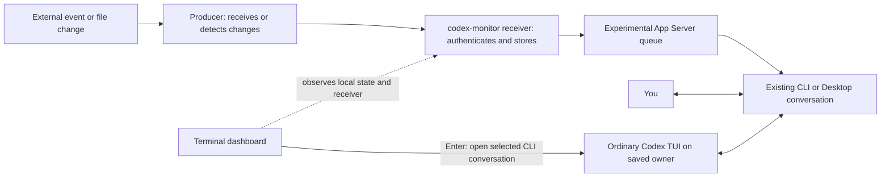

# codex-monitor

> This development branch includes an isolated [Rust runtime candidate](rust/README.md).
> See its [measured evaluation and adoption gates](docs/RUST-EVALUATION.md).
> The Python runtime remains the default; the instructions below describe that baseline.

**Keep working in your Codex conversation. Let external events come to you.**

codex-monitor connects file changes, webhooks and worker events to an existing **Codex CLI or Desktop conversation**. A small receiver waits outside the model, stores events and delivers them through Codex's **official but experimental App Server queue API**. You can keep typing in the same conversation while its owning client is loaded. Unloaded Desktop tasks retain queued input but do not automatically wake.

[Quick start](#quick-start) · [Execution model](#what-runs-where) · [Use cases](#what-can-i-use-it-for) · [Comparison](#how-it-compares) · [Status & evidence](docs/STATUS.md) · [Roadmap](docs/TODO.md)

## Why use it?

- **Keep the context.** Human messages and external events reach the conversation you chose.
- **Stay quiet between changes.** Waiting, file sampling and dashboard refreshes require no model turns. Event processing still uses the selected model.
- **Keep delivery inspectable.** Stored receipts, stable event IDs and explicit reply tracking help diagnose missing or uncertain deliveries.
- **Separate conversations when useful.** Route several sources into one PM conversation, or use independent conversations for different projects. A relay agent is optional.
- **See the connections.** A separate terminal dashboard shows configured conversations, collector observations and delivery states without adding chat messages.

This is an **external-condition and event-delivery layer**. It does not collect live model/tool
execution, token usage or cost telemetry. The dashboard shows delivery observations and explicit work
reports, not inferred agent progress. External messaging services need their own adapters.

Its built-in reliability features are a durable inbox, duplicate-ID suppression, receipt inspection,
uncertain-delivery reconciliation and an explicit reply outbox. These make delivery inspectable;
they do not guarantee loss-free operation, exactly-once side effects or successful agent work.

## What runs where?



| Component | What it does | When it runs |
|---|---|---|
| Skill: `$codex-monitor` | Helps configure, inspect and manage monitoring | When an assistant uses it; installing it alone starts nothing |
| Producer | Receives a webhook/Gateway event or detects a file change | Outside the model; managed files are supervised by the receiver |
| Receiver | Authenticates, persists, deduplicates and routes events | One long-lived local process; can serve multiple conversations |
| CLI resident (explicit owner mode) | Retains selected conversation subscriptions and restores them after connection loss | Separate foreground process alongside the shared App Server; no model polling |
| Codex conversation | Reads events and performs the authorized work alongside user input | Native Codex processing; busy conversations queue events |
| Dashboard | Reads monitor state and checks receiver readiness; Enter opens the selected CLI conversation | Refreshes without model calls; explicit TUI interaction follows normal Codex behavior |

**You normally run one receiver, your usual Codex client, and optionally the dashboard.** A Discord integration also needs a Gateway producer and reply adapter. It does not need an always-running model or a separate relay conversation.

The default `shared-local` path uses the same OS user and Codex store (`CODEX_HOME` / `sqlite_home`) as the target client. An independent App Server writer adds input through the official but experimental queue API; it does not type into the UI or start/resume conversations. Local Desktop does not require SSH.

In the validated Codex 0.153.4 path, the native consumer checks external changes roughly every 10 seconds. Busy turns can add delay. If the target conversation is unloaded (even while Desktop stays open), input remains queued until an owning client loads it. Keeping the receiver running does not keep every registered conversation loaded. **Event-driven does not mean an immediate model response.** See [latency measurements and direct-owner options](docs/LATENCY.md) and [queue/compatibility troubleshooting](docs/TROUBLESHOOTING.md).

**CLI is the current development priority for unattended conversations.** The explicit-owner
`resident` command keeps selected CLI conversations subscribed and restores those subscriptions
after connection loss. The ordinary TUI connects to that same server. This requires an owner and
resident process in addition to the receiver; see [setup and reconnect behavior](docs/OWNER-LIFECYCLE.md).
Default local Desktop does not yet have a verified owner connection for this lifecycle. A running
Desktop app alone therefore cannot guarantee background processing of every saved conversation.

### Start from Desktop, keep monitoring in CLI

You can ask a Desktop assistant to configure **a local CLI monitoring task**. Desktop is where you
request setup; a separate CLI owner and resident keep the selected task available. No SSH is required.
Open its ordinary TUI to converse, inspect work, or answer approvals, and use `codex-monitor dashboard`
to see registered monitoring routes without chat polling.

This does **not** keep the requesting Desktop conversation loaded. Arbitrary unloaded Desktop tasks
still cannot self-start from a shared queue write. Reusing a Desktop task in CLI requires a deliberate
ownership transition; independent Desktop and CLI servers cannot both own it. A separate CLI task's
responses do not automatically return to the Desktop requesting task.

See [Desktop-to-CLI setup, example request, status checks and stop controls](docs/OWNER-LIFECYCLE.md#request-from-desktop-run-through-cli).

## Quick start

Requires **Python 3.11+**, Codex CLI and a local CLI/Desktop conversation. The installer supports macOS and Linux and installs the Python `websockets` dependency.

```bash
git clone https://github.com/Jaemani/codex-monitor.git
cd codex-monitor
python3 scripts/install.py --with-skill install
codex-monitor --help
```

The default installer registers `~/.local/bin/codex-monitor`. If that directory is not on your
`PATH`, follow the printed shell hint or use the printed absolute command. Plugin-only installation
provides Codex integration assets; run the trusted runtime installer once to add the executable.

Start a new Codex session for skill discovery, then ask:

```text
$codex-monitor Watch /absolute/project/build-status.json in this conversation.
Keep unchanged observations quiet. Set up the receiver and show its status.
```

Choose a real regular file. The first sample establishes a silent baseline; later changes send metadata, not file contents. The skill helps configure the installed runtime; installation alone does not select a conversation or start a producer.

<details>
<summary>Manual setup instead of the skill</summary>

Set `THREAD_ID` to your exact existing conversation ID. Initialize a new state once; reuse existing state on subsequent runs.

```bash
codex-monitor init
codex-monitor doctor --thread "$THREAD_ID"
codex-monitor monitor create build --thread "$THREAD_ID" --file /absolute/project/build-status.json
codex-monitor serve
```

`serve` stays in the foreground. For persistent macOS operation use the installed runtime's `service install`; see [receiver operations](docs/OPERATIONS.md). On Linux use an OS supervisor appropriate to your host. Use the same `--state PATH` throughout when changing the default `~/.local/state/codex-monitor`.

</details>

See [installation and upgrades](docs/INSTALLATION.md), [file monitor lifecycle](docs/CONVERSATION-MONITORS.md), and [external source setup](docs/SESSION-WORKFLOW.md). A public repository is not a package-registry release.

## Watch the connections

From a second terminal, with the receiver running:

```bash
codex-monitor dashboard
```

The **Live** dot pulses while the view refreshes. Green, red and amber status dots distinguish
configuration and observed health. Use `--no-animate` or `--color never` when preferred.

Select a conversation with the arrow keys and press **Enter** to open its ordinary Codex
TUI. Read events and responses, send messages, or answer approvals; exit the TUI to return to the
dashboard. Opening uses the binding's explicit shared owner endpoint and the same conversation ID.
`shared-local` bindings need an explicit owner endpoint before they can be opened this way.

The Graphite view shows one row per conversation, status dots, connection counts and recent delivery observations.
The selected route appears below the list; use **Tab** to cycle routes before opening it.
Project groups and stable display names distinguish similar agents across projects. **p** stops
the selected monitor route, **r** resumes it, and **x**, then **y**, removes it while preserving
the Codex conversation. See [groups and controls](docs/DASHBOARD.md).
Press **d** for technical details such
as conversation IDs, owner endpoints and receipt states. Green/red dots describe the displayed
binding or receiver; they do not imply that an agent is currently generating or has finished work.

Use `--once` for a snapshot, `--once --json` for structured output, or `--thread "$THREAD_ID"` to filter a conversation. The display refreshes observations without calling Codex or the model. See [dashboard controls and status meanings](docs/DASHBOARD.md).

The inventory covers bindings in the selected local state, not every Codex agent or every host. External producer health stays **unknown** until a supported observation exists. A running receiver, an accepted event and a completed work request are different facts. Native consumption remains an explicit `inspect DELIVERY_ID` check.

### Are monitors related?

Monitors are grouped by their **destination conversation**, not a parent agent. One conversation can
receive several monitors, and one receiver can serve several independent conversations. A PM or relay
conversation is optional: choose it when you want coordination, or route each source directly to its
project conversation. Sharing a receiver does not create a team or broadcast events to every binding.
See the [domain vocabulary](CONTEXT.md).

## What can I use it for?

| Goal | Setup | When the conversation receives input |
|---|---|---|
| Keep coding while a build finishes | Managed status-file monitor | Observed file changes after the initial baseline |
| Alert on sustained failure and recovery | JSON pointer predicate plus debounce | A matched or recovered condition stays stable |
| Collect updates from several workers in one PM conversation | Authenticated worker producers and selected bindings | Workers report relevant blocked, failed or completed work |
| Keep separate project conversations available | Independent monitors and exact conversation IDs | Each project's events route to its configured conversation |
| Relay requests from a messaging service | External service producer, optional relay, explicit reply adapter | A relevant incoming request arrives |
| Track requested work beyond delivery | Correlated request lifecycle | Explicit progress and terminal state transitions |
| Recover a service only when unhealthy | OS timer + included HTTP probe example + authorized recovery policy | Confirmed outage; healthy checks and recovery stay quiet |

Managed file collectors, predicates and request tracking are implemented. CI, Discord and other service-specific integrations require adapters; the core does not bundle a Discord bot. Source-side filtering prevents routine progress chatter from waking the model. See [copyable skill requests and usage details](docs/EXAMPLES.md).

For “check the server without spending chat tokens, then ask Codex to repair it only on failure,” see
the [OS timer health-hook recipe](docs/HEALTH-HOOK.md). The timer runs a script, not a model prompt.

## How it compares

Feature scope checked **2026-09-09**; Monitor, Channels and telemetry references rechecked **2026-09-10**.
Claude entries describe its official documentation; they are not results from a matched benchmark.

**✅ Supported · ◐ Conditional / requires setup · ❌ Not provided · ? Not verified · — Not applicable**

“Native Codex” means local CLI/Desktop without this project. “With monitor” includes native Codex
features. A ✅ describes the specific row, not production certification. Footnotes explain limits.

### Events and conversation

| Feature | Native Codex | With monitor | Claude Code |
|---|:---:|:---:|:---:|
| Human input in the monitored conversation | ✅ | ✅ | ✅ |
| External events into an existing local conversation | ◐ Custom integration[^native] | ✅ | ◐ Channels[^channels] |
| Wait for events without model polling | ◐ Integration-dependent | ✅ | ✅[^claude-monitor] |
| Queue events during an active response | ✅ | ✅ | ✅[^channels] |
| Native background monitoring tool | ◐ Tool-dependent | ◐ External runtime | ✅ Monitor[^claude-monitor] |
| Stream arbitrary command output into the conversation | ◐ Custom producer | ◐ Custom producer | ✅ Monitor[^claude-monitor] |
| Subscribe directly to an arbitrary WebSocket feed | ◐ Custom producer | ◐ Custom producer | ✅ Monitor[^claude-monitor] |
| Auto-start monitors declared by a plugin | ◐ Integration-dependent | ❌ Explicit runtime setup | ✅[^claude-monitor] |
| Managed file/JSON conditions and debounce | ◐ Build integration | ✅ | ◐ Write script[^claude-monitor] |
| Server-failure-only recovery requests | ◐ Build integration | ◐ Health probe[^adapters] | ◐ Monitor / script[^claude-monitor] |
| Receive arbitrary webhook events | ◐ Build integration | ✅ HTTP receiver | ◐ Channel server[^channels] |
| Reply to the originating external source | ◐ Tool / adapter | ◐ Outbox + adapter[^adapters] | ◐ Channel reply tool[^channels] |

### Availability and recovery

| Feature | Native Codex | With monitor | Claude Code |
|---|:---:|:---:|:---:|
| Continue monitoring after closing the TUI window | ◐ Separate owner[^owner] | ◐ Owner + resident[^owner] | ❌ Session must run[^channels] |
| Retain events while target conversation is offline | ◐ Queue integration[^native] | ✅ Durable intake[^retention] | ◐ Adapter storage[^channels] |
| Automatically wake an unloaded local Desktop task | ? No verified path | ❌[^desktop] | ❌ Channels / Monitor[^claude-monitor] |
| Request in Desktop, execute through local CLI | ◐ Explicit setup | ✅ Setup workflow[^desktop] | — Outside this comparison |
| Restore selected CLI subscriptions after owner reconnect | ◐ Build integration | ✅ Resident[^owner] | ? Not tested |
| Durable inbox + duplicate-ID suppression | ◐ Build integration | ✅[^retention] | ◐ Adapter responsibility[^channels] |
| Inspect queued / consumed / uncertain delivery | ◐ API integration | ✅ Receipts | ◐ Adapter responsibility[^channels] |
| Reconcile a timed-out submission before replaying | ◐ Build integration | ✅ Stable client ID[^retention] | ◐ Adapter responsibility[^channels] |
| Uniform sub-second event response | ❌ No guarantee | ❌[^latency] | ❌ No guarantee |
| Native scheduled work | ✅ | ✅ Native feature | ✅[^schedules] |
| Async hook can wake an idle session | ◐ Hook-dependent | ◐ External queue[^desktop] | ✅ asyncRewake[^hooks] |

### Visibility and control

| Feature | Native Codex | With monitor | Claude Code |
|---|:---:|:---:|:---:|
| Native subagents and activity UI | ✅ | ✅ Native feature | ✅ |
| Multiple source/conversation routes | ◐ Build integration | ✅ | ◐ Channels / server setup[^channels] |
| Monitor project groups and stable role names | ❌ Monitor registry | ✅ | ? Equivalent not verified |
| Cross-conversation monitor dashboard | ❌ Monitor registry | ✅ Separate TUI | ? Equivalent not verified |
| Pause / resume / remove individual monitor routes | ◐ Integration-dependent | ✅ Dashboard[^controls] | ◐ Mechanism-dependent |
| Native monitor indicator / lifecycle UI | ◐ Tool-dependent | ❌ Separate dashboard | ✅[^claude-monitor] |
| Explicit external-request progress / expiry tracking | ◐ Build integration | ✅ | ◐ Build integration |
| Preserve native sandbox and approval decisions | ✅ | ✅ | ✅ |
| External-channel permission approval relay | ? Not assessed | ❌ | ◐ Opt-in relay[^channels] |
| Full monitoring after plugin installation alone | ❌ Setup needed | ❌ Runtime + source + owner | ◐ Plugin / account limits[^channels] |

### Event monitoring versus execution telemetry

| Meaning of monitoring | codex-monitor | Claude Code |
|---|---|---|
| Detect external changes and deliver events | ✅ Runtime + producers | ✅ Monitor / Channels, subject to setup limits |
| Inspect persisted delivery and explicit work reports | ✅ Receipts + request state | ◐ Channel-server design |
| Export model/API/tool activity, token usage and cost | ❌ Not collected by this project | ◐ Configure OTel[^telemetry] |
| Infer percentage complete from a received event | ❌ | ❌ No guarantee |

Codex's own diagnostics and native activity UI remain separate; this table does not assert that
native Codex lacks telemetry. Explicit `completed` request reports are caller-supplied state, not an
independent audit that the requested work succeeded.

### What the symbols do not hide

[^telemetry]: Claude [OpenTelemetry monitoring](https://code.claude.com/docs/en/monitoring-usage) exports usage/cost metrics, API and tool events, and optional traces to a configured backend. It is separate from Monitor and Channels; it is not an automatic event-delivery receipt or a guaranteed live progress percentage.
[^native]: Native Codex exposes [App Server APIs](https://learn.chatgpt.com/docs/app-server); custom clients can build event integrations. Eligible hosted app-event tasks are a separate surface, not generic local Desktop push. Native capability is not the same as a bundled monitoring workflow.
[^channels]: Claude Channels requires an opted-in running session and eligible account/plugin/org settings. Channel servers implement external adapters, reply tools and any offline persistence. See [Channels](https://code.claude.com/docs/en/channels) and [reference](https://code.claude.com/docs/en/channels-reference).
[^claude-monitor]: Claude's native [Monitor](https://code.claude.com/docs/en/tools-reference#monitor-tool) accepts script output or WebSocket events; scripts can implement watches and checks. Availability has provider/settings restrictions. Monitors stop with their session or owning subagent. This does not describe Desktop schedules or cloud Routines.
[^adapters]: codex-monitor includes a receiver, managed collectors and a source-scoped reply outbox. External services need producers/reply adapters. Server health checks run outside the model; only relevant transitions should wake it. See [health-hook recipe](docs/HEALTH-HOOK.md).
[^owner]: Closing a TUI is different from stopping its owner. codex-monitor's `resident` retains exact subscriptions on a separately running CLI App Server. Owner, resident, receiver and host must remain available or be supervised. Reconnect does not complete interrupted work or answer approvals. See [owner lifecycle](docs/OWNER-LIFECYCLE.md).
[^retention]: Retention is not execution. Durable input waits for an available consumer, with configured expiry/retry limits. Duplicate suppression does not guarantee exactly-once business side effects.
[^desktop]: Loaded Desktop conversations can consume shared-local events. Unloaded ones do not self-start; the existing Desktop owner has no verified public attachment path. A Desktop assistant can configure a separate local CLI monitoring task, but this does not keep its own Desktop chat resident or automatically relay replies back. See [Desktop-to-CLI workflow](docs/OWNER-LIFECYCLE.md#request-from-desktop-run-through-cli).
[^latency]: Tested shared-local queue observation is roughly 10 seconds. Explicit-owner CLI delivery has lower measured latency, but busy turns add delay. No matched Claude latency benchmark exists. See [measurements](docs/LATENCY.md).
[^schedules]: Native schedules are distinct from event monitoring. Claude `/loop`, Desktop schedules and cloud Routines have different lifetime and hosting rules; see sources C3, C7 and C8 below.
[^hooks]: Claude `asyncRewake` can wake an idle session on exit code 2. Ordinary async completion waits for a later turn. A lifecycle hook is not a durable external inbox.
[^controls]: Dashboard controls target the selected route. They preserve native history and receipts, cannot retract accepted input, and do not start external producers or revive unloaded Desktop tasks. Dots indicate component/configuration state, not proven task success.

Sources: [O1: scheduled tasks](https://learn.chatgpt.com/docs/automations), [O2: App Server](https://learn.chatgpt.com/docs/app-server), [O3: subagents](https://learn.chatgpt.com/docs/agent-configuration/subagents), [O4: hooks](https://learn.chatgpt.com/docs/hooks), [C1: Channels](https://code.claude.com/docs/en/channels), [C2: Channels reference](https://code.claude.com/docs/en/channels-reference), [C3: session schedules](https://code.claude.com/docs/en/scheduled-tasks), [C4: hooks](https://code.claude.com/docs/en/hooks), [C5: subagents](https://code.claude.com/docs/en/sub-agents), [C6: teams](https://code.claude.com/docs/en/agent-teams), [C7: Desktop schedules](https://code.claude.com/docs/en/desktop-scheduled-tasks), [C8: cloud Routines](https://code.claude.com/docs/en/routines), [C9: Monitor tool](https://code.claude.com/docs/en/tools-reference#monitor-tool).

**Native Codex already supports visible agents and scheduled work.** This project's advantage is its reusable external-event delivery, persistence and observation layer for existing local conversations. Claude already provides native background monitoring through `Monitor`, and Channels offers session push with reply tools. There is no evidence for an overall reliability or speed superiority claim. See [detailed comparison and limitations](docs/PRODUCT-COMPARISON.md).

## What has been verified?

The CLI resident path now has a bounded real test with two ordinary TUI-created conversations:
closed-TUI event handling, same-owner reconnect, owner-down backlog retention and server restart
with both subscriptions restored. All four test events appeared once in native history and received
one response each. This does not establish unattended approvals, long-idle residency or OS reboot
recovery; Desktop owner access remains a separate limitation.

The core targets **Codex CLI 0.153.4** and experimental queue APIs. Evidence includes ordinary macOS/Linux TUI interaction, a one-hour TUI soak, a one-hour receiver outage test, Desktop consumption and user-observed restart, and installed runtime checks. These results have different scopes; they are not blanket platform certification.

Desktop draft/approval cases, Windows/WSL, OS sleep/reboot, fresh Desktop skill discovery and broader producer supervision remain open. Dashboard verification is recorded separately from Codex conversation-delivery tests. See [status](docs/STATUS.md), [test scope](docs/TESTING.md), [compatibility](docs/COMPATIBILITY.md), and [public evidence](docs/evidence/README.md).

## Development

```bash
python3 -m venv .venv
.venv/bin/python -m pip install -e '.[test]'
.venv/bin/python -m unittest discover -s tests -v
.venv/bin/python scripts/check-publication.py
```

Read [CONTRIBUTING.md](CONTRIBUTING.md) before publishing. Keep raw transcripts and credentials out of Git; update status and the backlog with material changes.
