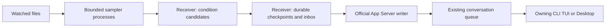

# Structural guarantees and limits

A monitor observes a source outside the model and places selected events into an existing conversation. Observation, durable intake, native consumption and completed work are different stages.

The sampler returns data only. It does not write monitor state or contact Codex. Lifecycle epochs let the receiver reject a sample from before a pause/resume cycle. Queue ownership stays with the native client.

## What the design can provide

- Conversation-scoped names, immutable monitor identities and isolated lifecycle controls.
- Durable event IDs and checkpoints, with explicit uncertain-delivery handling instead of blind replay.
- Silent initial/unchanged observations; time-based relevance decisions outside the model.
- Bounded sampler processes so a slow watched file does not block the receiver's sampling loop. Implementation and acceptance results for this change are tracked in STATUS.md.
- User interaction in the original conversation without automatic approvals or forced turn starts.

## What requires a qualified guarantee

Sampling has finite concurrency and scheduling capacity: at most eight child samples per receiver, at most two per conversation and one per monitor, with a two-second parent deadline. Timed-out workers still occupy their capacity until they actually exit. A normal timed-out child can be terminated and reaped. An OS process stuck in uninterruptible kernel I/O may not exit promptly even after a kill request. Resource limits prevent unlimited replacements within one receiver lifetime, but cannot guarantee progress if every slot or the host itself is stuck. The parent-death pipe terminates ordinary orphaned workers after a receiver crash. Forced receiver restarts cannot guarantee a machine-wide process bound when the kernel refuses to terminate old workers.

The state directory and SQLite database are shared by one receiver. Their filesystem must remain responsive. Isolating watched-file reads does not isolate failure of the state filesystem, disk exhaustion, the kernel or the machine.

A debounce window establishes that the samples observed by the monitor stayed equal; it cannot prove that a file did not change between samples. Downtime and explicit pause must not be presented as continuous observation. Restart handling must preserve durable candidates without silently declaring an unobserved interval healthy.

## Native client limits

The validated shared-local path uses the official native queue. Codex 0.153.4 observes external queue changes at roughly ten-second intervals. Placement therefore does not guarantee immediate model execution. An active turn, approval waiting, cancellation or a closed client may defer consumption further.

The receiver can continue collecting while the client is closed; it cannot make a closed conversation perform work. It does not force thread/start, thread/resume, turn/start or interrupt to work around this. A native background indicator and hidden channel input are not supplied by this project.

These limits do not establish that every future or differently hosted Codex adapter has the same restrictions. They describe the verified delivery path. Windows/WSL, OS sleep/reboot and Desktop interaction cases remain subject to the compatibility matrix.

See [status](STATUS.md), [compatibility](COMPATIBILITY.md) and [monitoring levels](MONITOR-LEVELS.md) for dated evidence rather than treating this design description as a test result.
