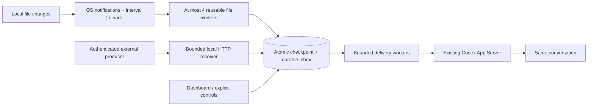

# Rust runtime candidate

This branch develops `codex-monitor-rs` alongside the Python runtime. It is an
isolated candidate, **not a replacement install**. Adoption is tracked in
[#14](https://github.com/Jaemani/codex-monitor/issues/14).

## Run from source

Requirements: Rust/Cargo (tested with 1.97.1), a C compiler for bundled SQLite,
and a compatible Codex CLI for native delivery (tested baseline: 0.153.4).
Benchmarks additionally use Python 3.11+, the Python project's dependencies,
and `pyte` for the opt-in ordinary TUI canary.

```sh
cargo build --release --manifest-path rust/Cargo.toml
rust/target/release/codex-monitor-rs --state /tmp/monitor-rust init
rust/target/release/codex-monitor-rs --state /tmp/monitor-rust monitor create health \
  --thread YOUR_THREAD_ID --file /absolute/path/health.json \
  --endpoint unix:///absolute/path/owner.sock
rust/target/release/codex-monitor-rs --state /tmp/monitor-rust serve
```

In another terminal:

```sh
rust/target/release/codex-monitor-rs --state /tmp/monitor-rust dashboard
```

## Install the Rust executable

The Rust candidate has a separate installer and prefix. Build the executable,
then pass that exact file to the installer:

```sh
cargo build --release --manifest-path rust/Cargo.toml
python3 rust/installer.py \
  --prefix "$HOME/.local/share/codex-monitor-rust" \
  --state "$HOME/.local/state/codex-monitor-rust" \
  --binary "$PWD/rust/target/release/codex-monitor-rs" install
```

The defaults are `~/.local/share/codex-monitor-rust` for the versioned runtime
prefix and `~/.local/state/codex-monitor-rust` for Rust state. The installer
creates `bin/codex-monitor-rs` inside the prefix, backed by an atomic `current`
pointer. Every release stores its binary, version, validation result and
SHA256 provenance under `releases/`. The state directory is outside the prefix
and is never copied, migrated or removed by these commands.

Inspect the owned releases before changing them:

```sh
python3 rust/installer.py \
  --prefix "$HOME/.local/share/codex-monitor-rust" \
  --state "$HOME/.local/state/codex-monitor-rust" status
```

Build a new executable and upgrade explicitly. The old validated release stays
available for rollback:

```sh
cargo build --release --manifest-path rust/Cargo.toml
python3 rust/installer.py \
  --prefix "$HOME/.local/share/codex-monitor-rust" \
  --state "$HOME/.local/state/codex-monitor-rust" \
  --binary "$PWD/rust/target/release/codex-monitor-rs" upgrade
python3 rust/installer.py \
  --prefix "$HOME/.local/share/codex-monitor-rust" \
  --state "$HOME/.local/state/codex-monitor-rust" \
  rollback --release RELEASE_ID_FROM_STATUS
```

`install`, `upgrade` and `rollback` run the candidate with `--version` and
`--help` before switching `current`. Use `--sha256 EXPECTED_HASH` when a
release checksum is available. An existing non-empty prefix, an unknown
ownership marker, modified release data or a foreign launcher is refused; the
installer never adopts files by discovery or removes an untracked directory.
Rollback also refuses to switch between different binary hashes when the Rust
state directory is populated, because this installer does not establish
database compatibility between runtime versions. Empty state or a target with
the same binary hash can be switched explicitly after release validation.

Uninstall is explicit and removes only a complete, unmodified prefix owned by
this installer:

```sh
python3 rust/installer.py \
  --prefix "$HOME/.local/share/codex-monitor-rust" \
  --state "$HOME/.local/state/codex-monitor-rust" uninstall
```

The install, upgrade, rollback and uninstall actions do not alter the Python
runtime, existing Python state, credentials or unrelated services. An
explicit service action can supervise this Rust receiver through the current
user's macOS launchd manager:

```sh
python3 rust/installer.py \
  --prefix "$HOME/.local/share/codex-monitor-rust" \
  --state "$HOME/.local/state/codex-monitor-rust" service-install
python3 rust/installer.py \
  --prefix "$HOME/.local/share/codex-monitor-rust" \
  --state "$HOME/.local/state/codex-monitor-rust" service-status
python3 rust/installer.py \
  --prefix "$HOME/.local/share/codex-monitor-rust" \
  --state "$HOME/.local/state/codex-monitor-rust" service-stop
python3 rust/installer.py \
  --prefix "$HOME/.local/share/codex-monitor-rust" \
  --state "$HOME/.local/state/codex-monitor-rust" service-start
python3 rust/installer.py \
  --prefix "$HOME/.local/share/codex-monitor-rust" \
  --state "$HOME/.local/state/codex-monitor-rust" service-restart
python3 rust/installer.py \
  --prefix "$HOME/.local/share/codex-monitor-rust" \
  --state "$HOME/.local/state/codex-monitor-rust" service-remove
```

The current bounded integration targets the current user's macOS launchd
domain. The plist and ownership marker live under the Rust prefix and pin the
immutable release binary that was validated at service installation. The
receiver's HTTP listener remains loopback-only. `service-status` reports
launchd registration and does not prove receiver health or Codex consumption.
The prefix-local plist is bootstrapped explicitly and does not register itself
for automatic login or reboot loading. Service installation does not discover
or modify Python jobs or system-wide supervisors. Upgrade and uninstall refuse
while this owned service exists; stop and remove it explicitly, then perform
the release operation and install the service again. Rust state migration,
cross-version state compatibility, Linux systemd integration and adoption as a
default runtime remain outside this isolated candidate workflow.

Use an explicit existing owner endpoint for unattended CLI conversations.
`resident --endpoint ENDPOINT --thread YOUR_THREAD_ID` retains a subscription;
`connect --endpoint ENDPOINT --thread YOUR_THREAD_ID` opens the ordinary Codex
TUI on that same owner. Neither command discovers a private Desktop endpoint.
`shared-local` delivers to saved queues but cannot load an unloaded Desktop task.

The default Rust directory is `~/.local/state/codex-monitor-rust`, configurable
with `CODEX_MONITOR_RUST_HOME` or `--state`. Its database is `rust.sqlite3`.
The runtime refuses a Python state directory. Credentials and existing Python
services are not automatically migrated. Sources added after startup require
a receiver restart, as in the Python runtime.

## Track a request from the CLI

Use the delivery receipt returned by an event already accepted for the selected
conversation and source. Request state is an explicit work report, not inferred
from queue acceptance or model activity.

```sh
rust/target/release/codex-monitor-rs --state /tmp/monitor-rust request create \
  --thread YOUR_THREAD_ID --source build --id build-42 --delivery DELIVERY_ID
rust/target/release/codex-monitor-rs --state /tmp/monitor-rust request update \
  --thread YOUR_THREAD_ID --source build --id build-42 \
  --update-id build-42-started --status in_progress --expected-revision 0
rust/target/release/codex-monitor-rs --state /tmp/monitor-rust request show \
  --thread YOUR_THREAD_ID --source build --id build-42
```

An optional `--expires-at` on creation uses Unix seconds. The running receiver
processes due expirations and pending transition notifications from local storage.
Its timer does not poll a model. Creating a request, acknowledging it, unchanged
state and replaying the same update do not create repeated notifications. Work
transitions can create input for the original conversation; they are not automatic
replies to the external sender. Source-authenticated HTTP request create/list/inspect/update endpoints are also
available. `request_lifecycle` and `request_http` capabilities are true; source
identity constrains every lookup.

## Execution structure



- Normal file observations reuse child processes. A stuck read can be timed out
  and its worker replaced. Sample workers do not initialize an async runtime.
- Idle file monitoring uses OS notifications and scheduled fallback reads.
  Baselines and unchanged samples do not generate model input. Fast transient
  changes are not a lossless filesystem journal.
- SQLite uses one persistent connection with WAL and full synchronization.
  A checkpoint and its new event commit together; pause/remove epochs reject
  stale work. Idle samples do not write heartbeat rows.
- Native connections are pooled per endpoint. Delivery does not resume tasks,
  start turns, interrupt generation or approve commands. Only explicit resident
  operation acquires subscriptions.
- Receipt, native queue acceptance, native consumption and completed user work
  remain distinct. Uncertain acceptance requires inspection before replay.

## Adoption gate

A faster partial implementation must not silently replace a complete workflow.
The Rust candidate currently includes the receiver, durable inbox, managed
collector, native transports, explicit resident/connect commands, reply outbox,
conversation grouping and terminal controls. Request create/update/list/show,
transition history, durable status notifications and automatic expiry are present
through CLI and authenticated HTTP. An isolated versioned installer is present;
service validation and deliberate cross-runtime state migration remain adoption work.

Dashboard dots use explicit owner observations: green filled means ready to
receive, red hollow means an observed owner/authentication/loading problem,
yellow half-filled means unverified, and a small dot means paused. A failing or
unverified active route prevents a multi-route conversation from appearing fully
ready. Account presence never proves valid credentials or successful model work.

The dashboard is a candidate implementation and still needs the same visual,
control and platform checks as the Python dashboard. The existing Python
Desktop/one-hour/packaging evidence does not transfer to Rust.

Required before default adoption:

1. Equivalent functional and fault cases pass with settled baselines.
2. Repeated matched measurements show useful resource improvement without lost
   stable transitions or unacceptable latency regressions.
3. Real ordinary TUI interaction, restart, disconnected UI and reconnect pass.
4. Remaining supported workflow, platform and distribution gaps are closed.

Raw measurements stay outside Git. See [evaluation](../docs/RUST-EVALUATION.md)
for dated results and limitations.
