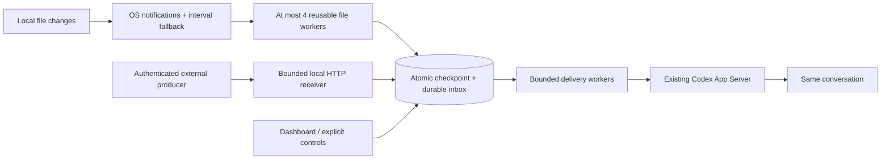

# Rust runtime candidate

This branch develops `codex-monitor-rs` alongside the Python runtime. It is an
isolated candidate, **not a replacement install**. Adoption is tracked in
[#14](https://github.com/Jaemani/codex-monitor/issues/14).

## Run from source

Requirements: Rust/Cargo (tested with 1.97.1), a C compiler for bundled SQLite,
and a compatible Codex CLI for native delivery (tested baseline: 0.153.4).
Benchmarks additionally use Python 3.11+, the Python project's dependencies,
and `pyte` for the opt-in ordinary TUI canary.

```sh
cargo build --release --manifest-path rust/Cargo.toml
rust/target/release/codex-monitor-rs --state /tmp/monitor-rust init
rust/target/release/codex-monitor-rs --state /tmp/monitor-rust monitor create health \
  --thread YOUR_THREAD_ID --file /absolute/path/health.json \
  --endpoint unix:///absolute/path/owner.sock
rust/target/release/codex-monitor-rs --state /tmp/monitor-rust serve
```

In another terminal:

```sh
rust/target/release/codex-monitor-rs --state /tmp/monitor-rust dashboard
```

Use an explicit existing owner endpoint for unattended CLI conversations.
`resident --endpoint ENDPOINT --thread YOUR_THREAD_ID` retains a subscription;
`connect --endpoint ENDPOINT --thread YOUR_THREAD_ID` opens the ordinary Codex
TUI on that same owner. Neither command discovers a private Desktop endpoint.
`shared-local` delivers to saved queues but cannot load an unloaded Desktop task.

The default Rust directory is `~/.local/state/codex-monitor-rust`, configurable
with `CODEX_MONITOR_RUST_HOME` or `--state`. Its database is `rust.sqlite3`.
The runtime refuses a Python state directory. Credentials and existing Python
services are not automatically migrated. Sources added after startup require
a receiver restart, as in the Python runtime.

## Execution structure



- Normal file observations reuse child processes. A stuck read can be timed out
  and its worker replaced. Sample workers do not initialize an async runtime.
- Idle file monitoring uses OS notifications and scheduled fallback reads.
  Baselines and unchanged samples do not generate model input. Fast transient
  changes are not a lossless filesystem journal.
- SQLite uses one persistent connection with WAL and full synchronization.
  A checkpoint and its new event commit together; pause/remove epochs reject
  stale work. Idle samples do not write heartbeat rows.
- Native connections are pooled per endpoint. Delivery does not resume tasks,
  start turns, interrupt generation or approve commands. Only explicit resident
  operation acquires subscriptions.
- Receipt, native queue acceptance, native consumption and completed user work
  remain distinct. Uncertain acceptance requires inspection before replay.

## Adoption gate

A faster partial implementation must not silently replace a complete workflow.
The Rust candidate currently includes the receiver, durable inbox, managed
collector, native transports, explicit resident/connect commands, reply outbox,
conversation grouping and terminal controls. Request create/update/list are
present, but the Python request notification outbox, expiry/history interfaces,
service installation and upgrade/migration workflow are not yet ported.

The dashboard is a candidate implementation and still needs the same visual,
control and platform checks as the Python dashboard. The existing Python
Desktop/one-hour/packaging evidence does not transfer to Rust.

Required before default adoption:

1. Equivalent functional and fault cases pass with settled baselines.
2. Repeated matched measurements show useful resource improvement without lost
   stable transitions or unacceptable latency regressions.
3. Real ordinary TUI interaction, restart, disconnected UI and reconnect pass.
4. Remaining supported workflow, platform and distribution gaps are closed.

Raw measurements stay outside Git. See [evaluation](../docs/RUST-EVALUATION.md)
for dated results and limitations.
